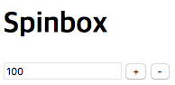

## 개발 환경

스핀 박스

## 테스트 환경

### 자스민: BDD 방식의 테스트 툴 [다운로드](https://jasmine.github.io/)

- 자스민 스탠드얼론: Nodejs 환경과 별개로 독립적으로 실행 [Link](https://github.com/apple77y/test_environment/tree/jasmine-standalone)
- 카르마 - 자스민: NPM 중 Karma 테스트 러너를 이용해서 자동화 [Link](https://github.com/apple77y/test_environment/tree/karma-jasmine)
